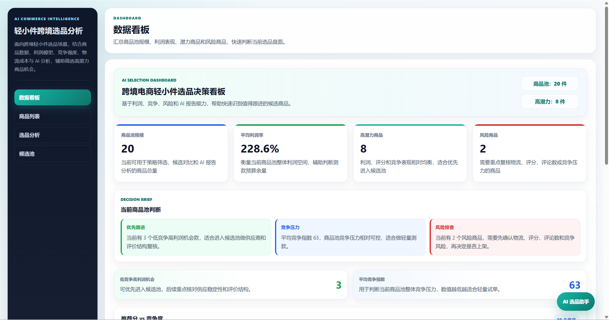
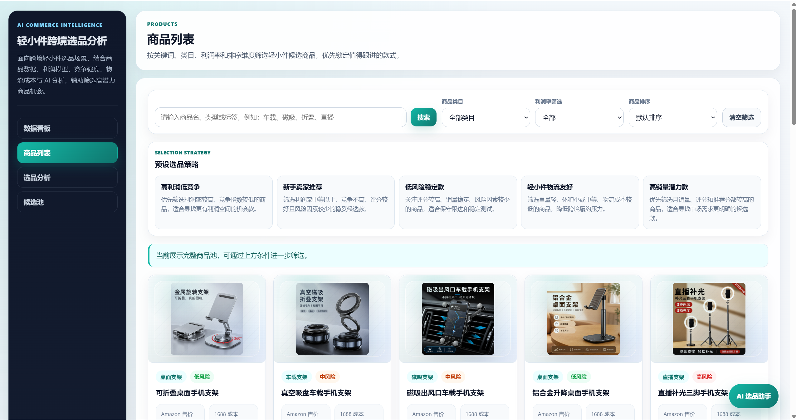
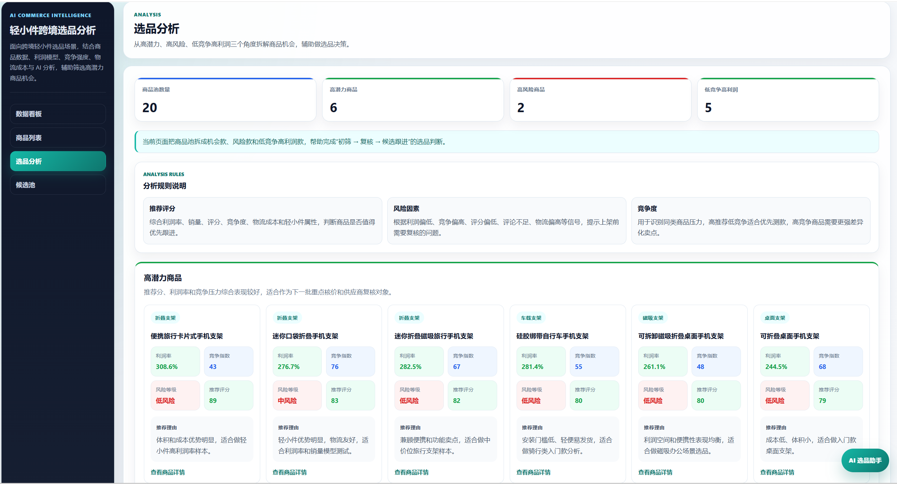
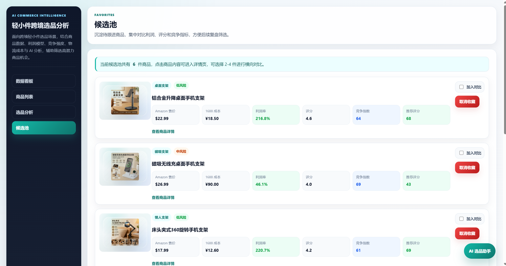
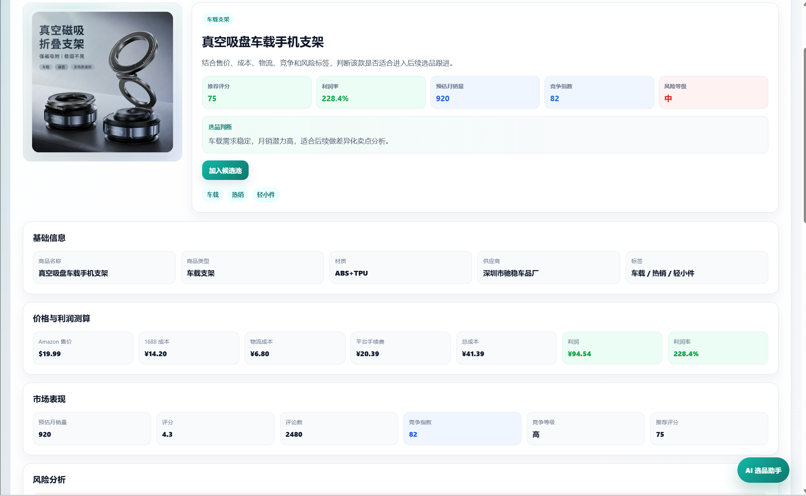
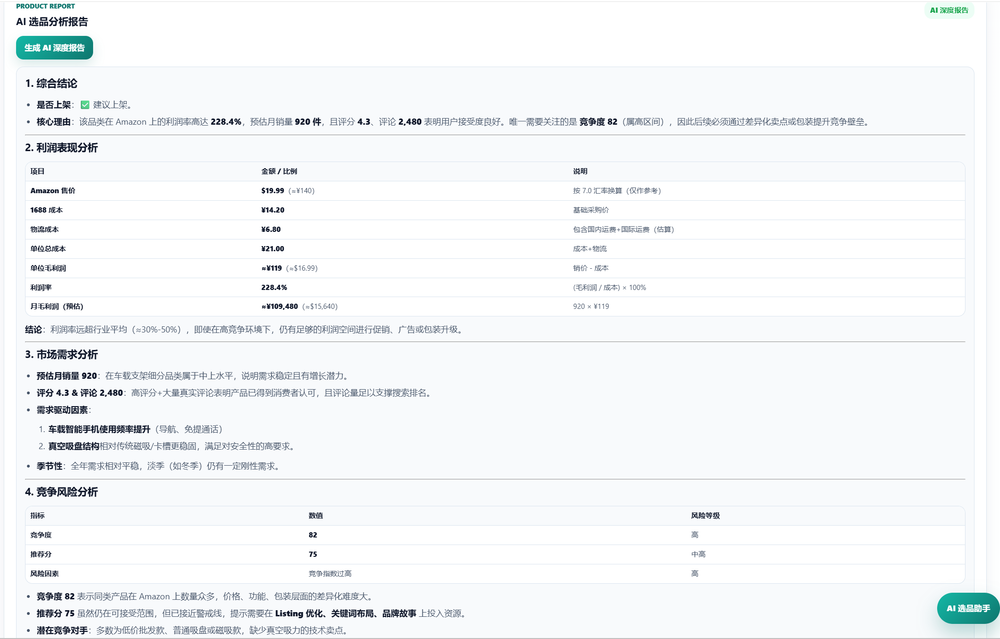
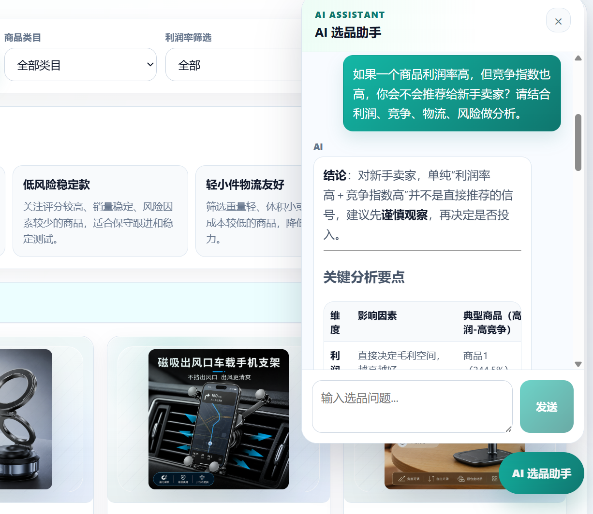

# 极瑞AI跨境选品分析平台

极瑞AI跨境选品分析平台是一个面向轻小件跨境选品场景的 AI 决策辅助平台。项目围绕商品数据分析、利润测算、竞争判断、风险识别、候选池管理、可视化看板和 AI 选品建议构建，目标是把零散的选品判断整理成可查询、可筛选、可沉淀的工程化工作流。

当前版本使用手机支架相关轻小件商品作为样例数据，用于验证商品池、指标计算、候选池和 AI 辅助分析流程。平台方向不限定于单一品类，后续可扩展到桌面收纳、旅行配件、车载小配件、手机周边、厨房小工具、宠物小用品等更多跨境轻小件候选商品。

## 项目背景

跨境轻小件选品通常需要同时判断售价、采购成本、平台费用、物流成本、销量、评分、评论数量、竞争强度、供应链风险和平台适配度。传统做法容易分散在表格、浏览器收藏、人工备注和临时沟通里，判断过程难以复用，也不利于持续观察。

本项目将商品样本、成本结构、市场信号、风险标签和 AI 分析整合到同一套页面与接口中，让选品流程可以围绕“发现候选商品、拆解利润、识别风险、加入候选池、持续分析”闭环运行。

## 项目目标

- 建立轻小件跨境选品的商品数据模型和分析流程。
- 支持商品列表、详情、Dashboard、选品分析和候选池管理。
- 用统一后端接口输出利润率、竞争等级、风险等级和推荐评分。
- 将 Supabase 商品数据、JSON 备份数据和前端页面连接成稳定的演示基线。
- 通过 AI 选品助手和 AI 商品报告，补充结构化指标之外的解释性建议。
- 为后续接入 1688 API、Amazon API 和更多轻小件品类预留扩展方向。

## 线上访问地址

- 前端访问地址：[https://app.xzmindpro.eu.cc/](https://app.xzmindpro.eu.cc/)
- 后端接口地址：[https://api.xzmindpro.eu.cc/](https://api.xzmindpro.eu.cc/)
- 健康检查地址：[https://api.xzmindpro.eu.cc/api/health](https://api.xzmindpro.eu.cc/api/health)

> 当前线上部署地址沿用历史 slug，平台公开名称以“极瑞AI跨境选品分析平台”为准。

## 截图展示

以下截图展示平台从“查看商品池整体表现、筛选候选商品、分析风险与利润、加入候选池、查看单品报告”到 AI 辅助判断的核心流程。大模型 API 接入是项目亮点之一，因此 README 同时内嵌 AI 深度报告和 AI 选品助手弹窗，更多页面状态通过链接查看。

### 核心流程截图

| 页面 | 截图 | 说明 |
| --- | --- | --- |
| Dashboard 数据看板 |  | 汇总商品池规模、平均利润率、高潜力商品、风险商品和图表分析，是选品判断的总览入口。 |
| 商品列表总览 |  | 展示商品卡片、利润率、风险等级、推荐评分和基础市场信号，支持快速发现候选商品。 |
| 选品分析页面 |  | 按高潜力、高风险、低竞争高利润等维度组织商品，帮助从不同策略视角筛选机会。 |
| 候选池管理 |  | 将重点商品加入候选池后，可继续对比利润、风险、竞争和推荐理由。 |
| 商品详情页 |  | 查看单个商品的基础信息、成本拆解、市场指标、风险标签和后续 AI 报告入口。 |
| AI 深度报告 |  | 基于商品指标和大模型 API 生成综合结论、利润分析、市场需求、竞争风险和下一步建议。 |
| AI 选品助手弹窗 |  | 围绕商品池上下文进行自然语言问答，辅助解释利润、竞争、物流和风险取舍。 |

### 更多截图

- Dashboard 图表补充：[dashboard2-chart.png](docs/screenshots/dashboard2-chart.png)
- 商品列表更多商品卡片：[product-list-2.png](docs/screenshots/product-list-2.png)
- 商品列表筛选 / 策略 / 排序状态：[product-filter-sort.png](docs/screenshots/product-filter-sort.png)
- 候选池横向对比表：[favorites-compare.png](docs/screenshots/favorites-compare.png)
- 高风险与低竞争高利润模块：[product-analyse-2.png](docs/screenshots/product-analyse-2.png)
- 基础规则选品报告：[basic-report.png](docs/screenshots/basic-report.png)

## 技术栈

### 前端

- React
- Vite
- JavaScript
- React Router
- Recharts
- react-markdown
- remark-gfm
- CSS

### 后端

- Node.js
- Express
- Vercel Serverless Functions
- Supabase PostgreSQL
- Supabase JavaScript SDK
- Zhipu GLM API
- NVIDIA NIM / OpenAI-compatible Chat Completions
- JSON 文件备份商品数据

## 核心功能

- Dashboard 数据看板：展示商品总数、平均利润率、高潜力商品、风险商品、利润率排行、类目分布和竞争概况。
- 商品列表：支持关键词搜索、类目筛选、最低利润率筛选、策略筛选和多维排序。
- 商品详情：展示商品基础信息、成本拆解、利润测算、市场指标、风险标签、推荐评分和推荐理由。
- 选品分析：按高潜力、高风险、低竞争高利润等维度组织商品池观察视角。
- 候选池管理：通过匿名 `client_id` 保存不同浏览器访问者的候选商品。
- AI 选品助手：结合商品池、候选池和结构化指标生成选品建议。
- AI 商品报告：围绕单个商品生成优势、风险、跟进优先级和验证方向。
- 缓存优化：前端 `localStorage` 缓存和后端短期内存缓存改善二次访问体验。

## 项目亮点

- 前后端分离架构，React + Vite 负责页面体验，Express 负责数据接口和 AI 服务封装。
- Supabase 作为商品池和候选池数据层，JSON 文件作为备份和导入来源。
- 后端统一补充利润率、总成本、竞争等级、风险等级、推荐评分等业务字段。
- 推荐评分同时参考利润空间、销量、评分、竞争强度和风险因素，便于商品优先级排序。
- 风险分析通过重量、体积等级、竞争指数、评分、评论和已有风险因素生成可解释标签。
- AI Key 只保存在后端环境变量，前端不直接暴露第三方服务密钥。
- AI 选品助手使用商品池和候选池上下文，形成轻量级 RAG 风格的动态商品知识库。
- 页面支持 stale-while-revalidate 体验，接口较慢时可优先展示缓存内容。

## 本地运行方式

### 1. 启动后端

```bash
cd server
npm install
npm start
```

默认后端地址：

```txt
http://localhost:3000
```

健康检查：

```txt
http://localhost:3000/api/health
```

### 2. 启动前端

```bash
cd client
npm install
npm run dev
```

默认前端地址由 Vite 输出，通常为：

```txt
http://localhost:5173
```

如需指定后端地址，可在前端环境变量中配置 `VITE_API_BASE_URL`。

## 环境变量说明

后端环境变量放在 `server/.env` 或部署平台的后端环境变量中。不要提交真实 `.env` 文件，不要把后端密钥写入前端代码，也不要使用 `VITE_` 前缀暴露后端密钥。

`server/.env.example` 使用占位值说明需要的变量：

```txt
SUPABASE_URL=your_supabase_project_url
SUPABASE_SERVICE_ROLE_KEY=your_supabase_secret_key
ZHIPU_API_KEY=your_zhipu_api_key
ZHIPU_MODEL=glm-4.7-flash
AI_PROVIDER=nvidia
NVIDIA_API_KEY=your_nvidia_api_key
NVIDIA_BASE_URL=https://integrate.api.nvidia.com/v1
NVIDIA_REQUEST_TIMEOUT_MS=12000
NVIDIA_MODELS=gpt-4,gemini-pro-100b,gemini-2.5-pro-100b,gemini-2-pro-100b
```

变量说明：

- `SUPABASE_URL`：Supabase 项目地址。
- `SUPABASE_SERVICE_ROLE_KEY`：后端使用的 Supabase service role key，只能放在服务端。
- `ZHIPU_API_KEY`：Zhipu AI 服务密钥。
- `ZHIPU_MODEL`：Zhipu 模型名称。
- `AI_PROVIDER`：AI 服务提供方，例如 `zhipu` 或 `nvidia`。
- `NVIDIA_API_KEY`：NVIDIA NIM API 密钥。
- `NVIDIA_BASE_URL`：NVIDIA OpenAI-compatible 接口基础地址。
- `NVIDIA_REQUEST_TIMEOUT_MS`：NVIDIA 请求超时时间。
- `NVIDIA_MODELS`：NVIDIA 模型候选列表。
- `VITE_API_BASE_URL`：前端请求后端 API 的公开基础地址，不包含任何密钥。

## 接口说明

| 方法 | 路径 | 说明 |
| --- | --- | --- |
| `GET` | `/api/health` | 后端健康检查 |
| `GET` | `/api/products` | 商品列表，支持搜索、筛选和排序 |
| `GET` | `/api/products/:id` | 商品详情 |
| `GET` | `/api/dashboard` | Dashboard 统计数据 |
| `GET` | `/api/favorites` | 获取当前匿名访问者候选池 |
| `POST` | `/api/favorites` | 添加商品到候选池 |
| `DELETE` | `/api/favorites/:id` | 从候选池移除商品 |
| `POST` | `/api/ai/chat` | AI 选品助手对话 |
| `POST` | `/api/ai/product-report` | 生成单商品 AI 分析报告 |

`GET /api/products` 支持常用查询参数：

- `keyword`：按商品名称、类目、标签搜索。
- `category`：按商品类目筛选。
- `minProfitRate`：按最低利润率百分比筛选。
- `sort`：按利润率、月销量、评分、竞争指数或推荐评分排序。

候选池相关接口需要请求头：

```txt
x-client-id: 当前浏览器匿名 client_id
```

## 项目目录结构

```text
.
├── client/                  # React + Vite 前端
│   ├── public/images/       # 商品图片等静态资源
│   └── src/
│       ├── components/      # 通用组件和图表组件
│       ├── pages/           # Dashboard、商品、详情、分析、候选池页面
│       ├── services/        # API 请求封装
│       └── utils/           # 前端格式化、筛选和展示辅助函数
├── server/                  # Express 后端
│   ├── data/                # JSON 备份商品数据
│   ├── routes/              # API 路由
│   ├── services/            # AI Provider 与商品上下文服务
│   ├── utils/               # 商品计算、映射、筛选、排序工具
│   └── scripts/             # Supabase 数据导入脚本
├── docs/                    # 公开产品、架构、数据、性能和路线文档
└── _private/                # 本地私有材料，已被 .gitignore 忽略
```

## 核心业务流程

1. 前端通过 `client/src/services/api.js` 请求后端 API。
2. 后端从 Supabase `products` 表读取商品主数据。
3. 后端工具函数补充收入、成本、利润、风险、竞争和推荐评分等字段。
4. 前端在 Dashboard、商品列表、详情页、分析页和候选池中复用统一数据结构。
5. 用户将值得跟进的商品加入候选池，后端按匿名 `client_id` 写入 Supabase `favorites` 表。
6. AI 接口读取商品池、候选池和商品详情上下文，再调用后端配置的 AI Provider 生成建议。

## AI 选品助手说明

AI 选品助手不是独立聊天工具，而是围绕当前商品池运行的决策辅助能力。后端会将商品名称、类目、利润率、竞争指数、风险因素、推荐评分、候选池状态等信息整理为上下文，再交给 AI Provider 生成回答。

主要使用场景：

- 询问当前商品池中更适合优先跟进的轻小件商品。
- 对比高利润、高风险、低竞争商品的取舍。
- 解释某个商品的风险原因和验证方向。
- 根据候选池给出下一步观察建议。
- 为单个商品生成 AI 分析报告。

AI 输出只作为辅助建议，真实选品仍需要结合供应商沟通、平台规则、市场调研和数据更新进行判断。

## Supabase 数据迁移说明

当前商品数据以 Supabase PostgreSQL 为主，`server/data/products.json` 作为备份和导入来源。导入脚本位于：

```txt
server/scripts/importProductsToSupabase.js
```

执行方式：

```bash
cd server
npm run import:products
```

脚本流程：

1. 读取 `server/data/products.json`。
2. 校验商品数组和商品 `id`。
3. 通过 `mapProductToRow` 将前端友好的商品字段映射为 Supabase 表字段。
4. 使用 `upsert` 写入 `products` 表，并以 `id` 作为冲突键。
5. 输出商品数量、成功写入数量、失败数量和失败原因。

执行前需要确认后端环境变量中已配置 `SUPABASE_URL` 和 `SUPABASE_SERVICE_ROLE_KEY`。

## 公开文档

- [产品概览](docs/product-overview.md)
- [技术架构](docs/architecture.md)
- [数据模型](docs/DATA_MODEL.md)
- [性能优化](docs/performance.md)
- [产品路线图](docs/roadmap.md)

## 后续优化方向

- 接入 1688 API，提升货源、采购成本、供应商、起订量和发货信息的数据时效性。
- 接入 Amazon API，提升候选商品、市场表现、评分、评论和竞争信号的更新能力。
- 扩展更多跨境轻小件品类，让类目、标签和筛选维度更数据驱动。
- 建立商品数据刷新、去重、质量校验和异常兜底机制。
- 增强 AI 建议与结构化指标之间的一致性，让回答更稳定地引用利润、风险、竞争和物流信息。
- 增加接口耗时、缓存命中率、AI 调用结果和部署状态的监控能力。
- 随商品规模扩大，补充分页、增量同步和更细粒度的缓存策略。

## 安全与维护说明

- 不提交 `.env`、`server/.env`、`client/.env`。
- 不在公开文档中写入真实 API Key、数据库密钥、service role key 或 token。
- `SUPABASE_SERVICE_ROLE_KEY`、`ZHIPU_API_KEY`、`NVIDIA_API_KEY` 只能放在后端环境变量中。
- 前端只允许使用公开配置，例如 `VITE_API_BASE_URL`。
- `_private/` 用于本地私有材料，公开 README 和 docs 不链接该目录。
